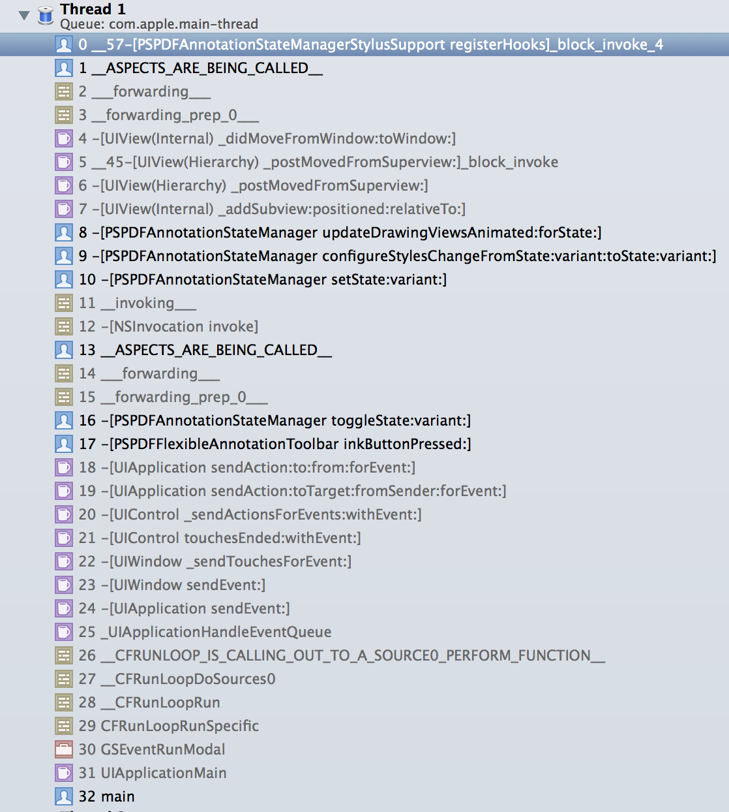

Aspects v1.0.0 [](https://travis-ci.org/steipete/Aspects)
==============

Delightful, simple library for aspect oriented programming by [@steipete](http://twitter.com/steipete).

**Think of Aspects as method swizzling on steroids. It allows you to add code to methods either per object or per class**, and you can choose the insertion point (before/instead/after). Aspects automatically deals with calling super and is easier to use than regular method swizzling.

Aspects extends NSObject with the following methods:

``` objc
- (id)aspect_hookSelector:(SEL)selector
               atPosition:(AspectPosition)injectPosition
                withBlock:(void (^)(id object, NSArray *arguments))block;

+ (id)aspect_hookSelector:(SEL)selector
               atPosition:(AspectPosition)injectPosition
                 withBlock:(void (^)(id object, NSArray *arguments))block;

+ (BOOL)aspect_remove:(id)aspect;
```

Adding aspects returns an opaque token which can be used to deregister again. All calls are thread safe.

Aspects uses Objective-C message forwarding to hook into messages. This will create some overhead. Don't add aspects to methods that are called a lot. This means it's not a good fit for your model, but works well for view or controller code.

Aspects collects all arguments in the `arguments` array. Primitive values will be boxed.

When to use Aspects
-------------------
Aspects makes it really convenient to add blocks of code to a method, and is much simpler to use than regular swizzling. I've written it for use in [PSPDFKit](http://pspdfkit.com) where we required notifications when a view controller is being dismissed modally. This includes UIKit view controllers like `MFMailComposeViewController` or `UIImagePickerController`. Now we could have created subclasses for each of these controllers, but this would be quite a lot of unnecessary code. Aspects gives you a simpler solution:

``` objc
@implementation UIViewController (DismissActionHook)

// Will add a dismiss action once the controller gets dismissed.
- (void)pspdf_addWillDismissAction:(void (^)(void))action {
    PSPDFAssert(action != NULL);

    __weak __typeof(self)weakSelf = self;
    [self aspect_hookSelector:@selector(viewWillDisappear:) atPosition:AspectPositionAfter withBlock:^(id object, NSArray *arguments) {
        if (weakSelf.isBeingDismissed) {
            action();
        }
    }];
}

@end
```

Debugging
---------
Aspects identifies itself nicely in the stack trace, so it's easy to see if a method has been hooked:



Using Aspects with methods with a return type
---------------------------------------------

When you're using Aspects with `AspectPositionInstead`, the last argument of the `arguments` array will be the `NSInvocation` of the original implementation. You can use this invocation to customize the return value:

``` objc
    [PSPDFDrawView aspect_hookSelector:@selector(shouldProcessTouches:withEvent:) atPosition:AspectPositionInstead withBlock:^(id object, NSArray *arguments) {
        // Call original implementation.
        BOOL processTouches;
        NSInvocation *invocation = arguments.lastObject;
        [invocation invoke];
        [invocation getReturnValue:&processTouches];

        if (processTouches) {
            processTouches = pspdf_stylusShouldProcessTouches(arguments[0], arguments[1]);
            [invocation setReturnValue:&processTouches];
        }
    }];
```

Installation
------------
The simplest option is to use `pod "Aspects"`.
You can also add the two files NSObject+Aspects.h/m. There are no further requirements.


Release Notes
-----------------

Version 1.0.0

- Initial release

Credits
-------
The idea to use `_objc_msgForward` and parts of the `NSInvocation` argument selection is from the excellent [ReactiveCocoa](https://github.com/ReactiveCocoa/ReactiveCocoa) from the GitHub guys.


Supported iOS & SDK Versions
-----------------------------

* Aspects requires ARC.
* Aspects is tested with iOS 6+.

License
-------
MIT licensed, Copyright (c) 2014 Peter Steinberger, steipete@gmail.com, http://twitter.com/steipete